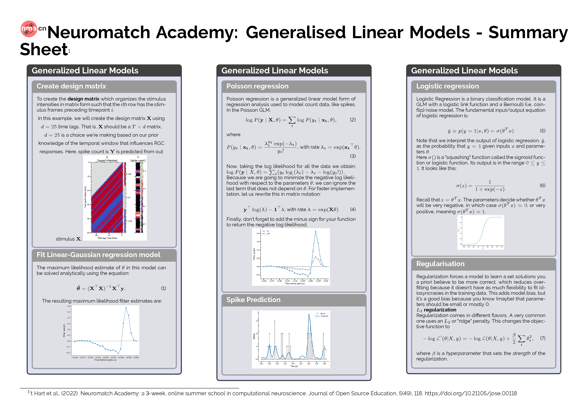

# Latex Code for Neuromatch Machine Learning Summary Sheet

This repository contains the latex code to generate the Summary Sheets for the Machine Learning Days for [Neuromatch Academy Compuational Neuroscience Summer School 2022](https://compneuro.neuromatch.io/tutorials/intro.html)

<blockquote class="twitter-tweet">
I was a bit minimal on the Generalised Linear Model (W1D3) <a href="https://twitter.com/neuromatch?ref_src=twsrc%5Etfw">@neuromatch</a> summary sheet but the tutorials by Cristina Savin, Pierre-Etienne Fiquet, <a href="https://twitter.com/arisbenjamin?ref_src=twsrc%5Etfw">@arisbenjamin</a> <a href="https://twitter.com/jakhmack?ref_src=twsrc%5Etfw">@jakhmack</a> have loads of more materials. I&#39;m also retweeting the musical pairing👇as I like it 😃 <a href="https://t.co/C1uF3GUpc1">https://t.co/C1uF3GUpc1</a> <a href="https://t.co/my0y2Khri5">pic.twitter.com/my0y2Khri5</a>
&mdash; John Butler (@jslbutler) <a href="https://twitter.com/jslbutler/status/1547193236686622726?ref_src=twsrc%5Etfw">July 13, 2022</a></blockquote> 

## Reference 
't Hart et al., (2022). Neuromatch Academy: a 3-week, online summer school in computational neuroscience. Journal of Open Source Education, 5(49), 118, https://doi.org/10.21105/jose.00118
